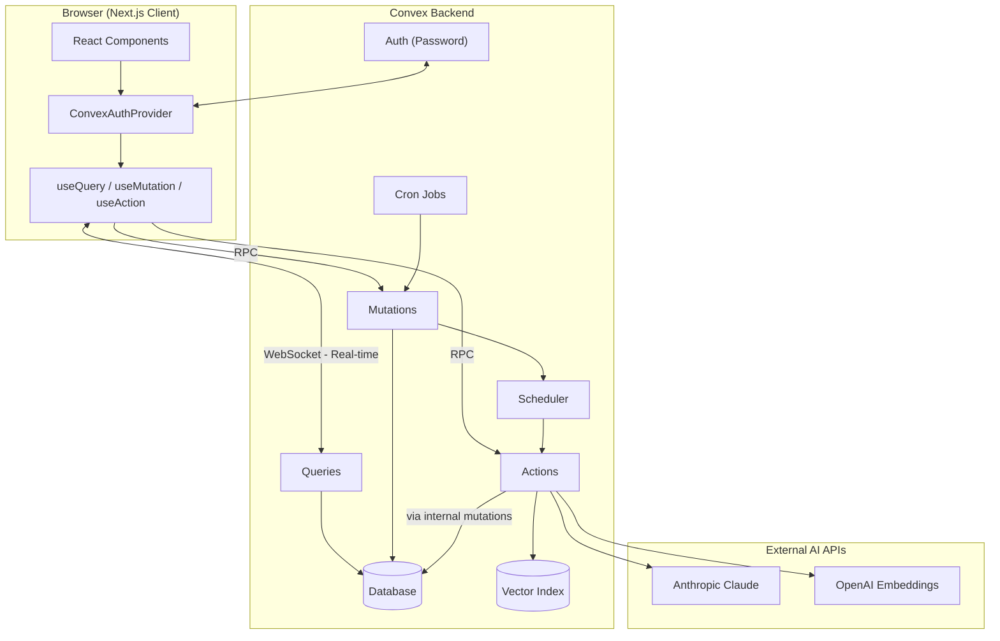
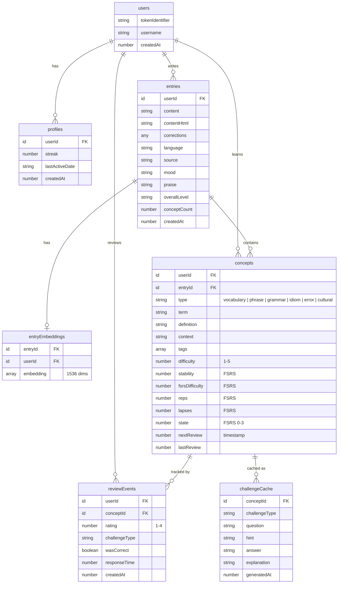
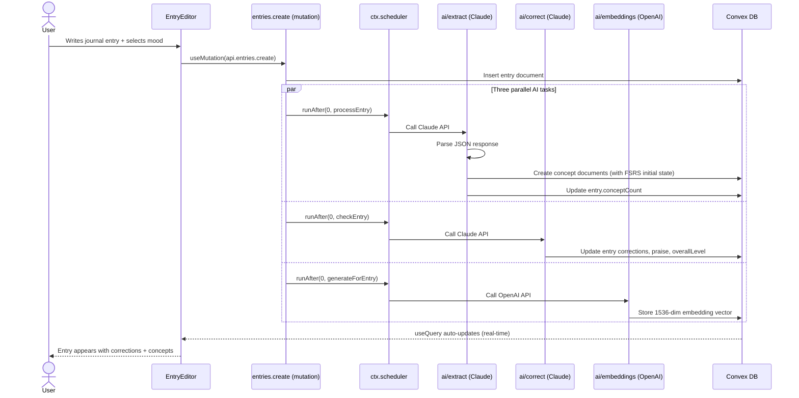
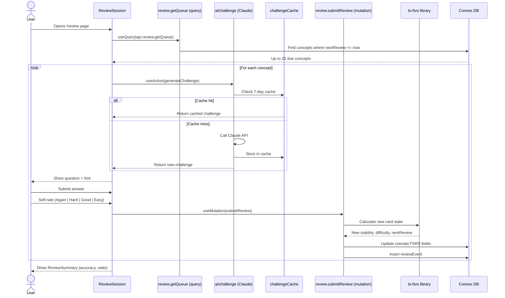
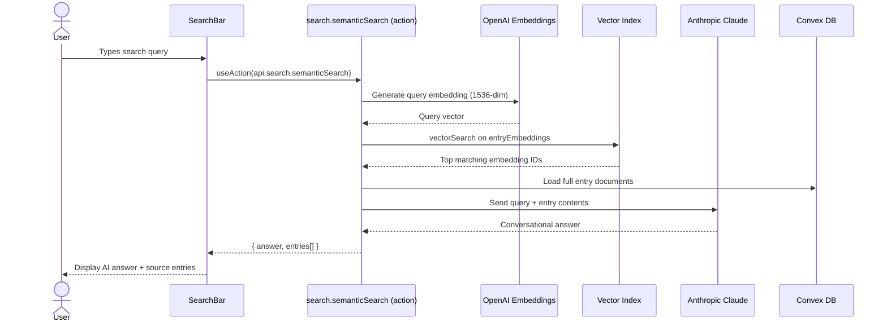
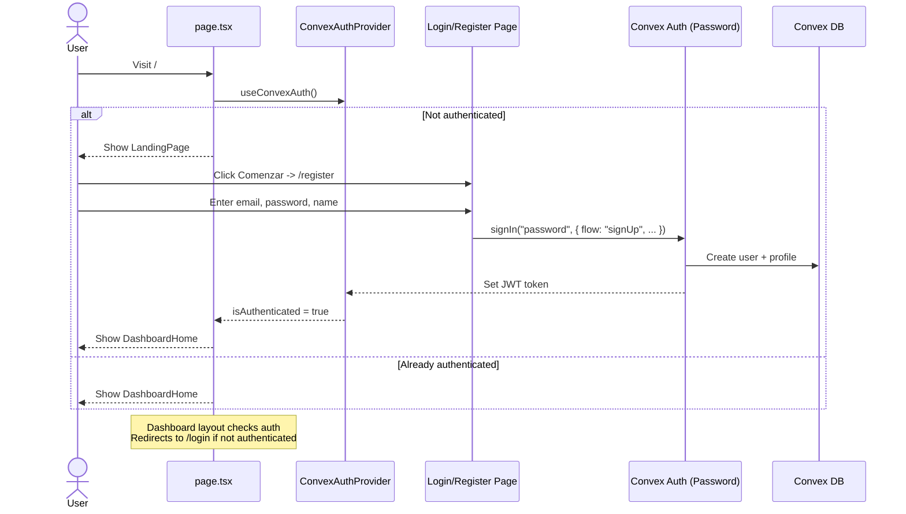
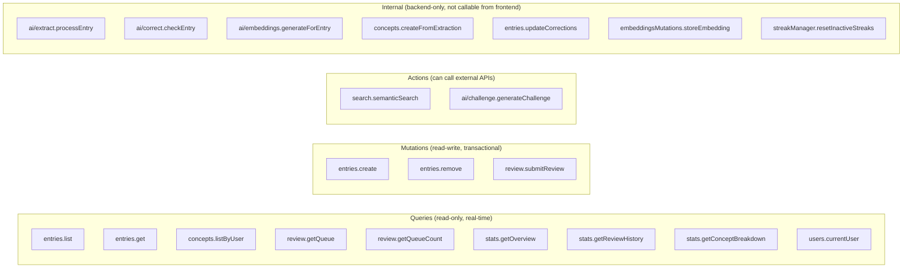
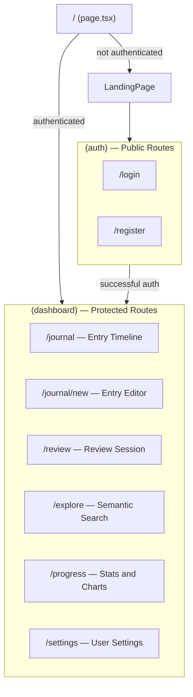
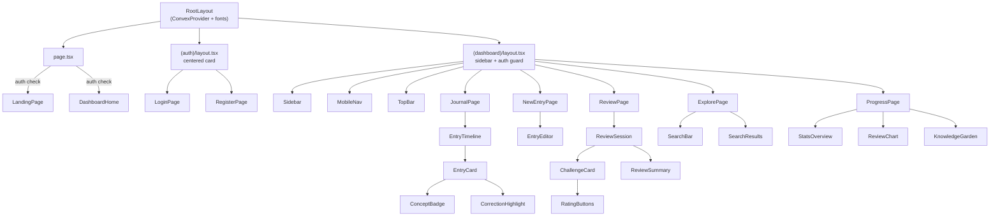

# Bitácora — Tu Diario de Aprendizaje de Inglés

An AI-powered English learning journal that combines **free writing**, **AI analysis**, and **spaced repetition** to help you learn English effectively. Write journal entries in English, get instant corrections and concept extraction, then review what you've learned using scientifically-proven spaced repetition.

## Tech Stack

| Layer | Technology | Purpose |
|-------|-----------|---------|
| Frontend | Next.js 16 (App Router) | React framework with route groups |
| Backend | Convex | Database, serverless functions, auth, vector search, cron jobs |
| AI - Language | Anthropic Claude Sonnet 4 | Concept extraction, grammar correction, challenge generation |
| AI - Search | OpenAI text-embedding-3-small | 1536-dim embeddings for semantic search |
| Spaced Repetition | ts-fsrs | FSRS algorithm for optimal review scheduling |
| UI Components | shadcn/ui + Base UI | Accessible component library |
| Styling | Tailwind CSS v4 | Utility-first CSS with custom theme |
| Charts | Recharts | Progress visualization |
| Auth | @convex-dev/auth (Password) | Email/password authentication |

---

## High-Level Architecture



---

## Project Structure

```
learning-bitacora/
├── src/
│   ├── app/                          # Next.js App Router
│   │   ├── layout.tsx                # Root layout (ConvexProvider + fonts)
│   │   ├── page.tsx                  # Home: LandingPage or DashboardHome
│   │   ├── globals.css               # Tailwind config + custom theme
│   │   ├── (auth)/                   # Route group: public auth pages
│   │   │   ├── layout.tsx            # Centered card layout
│   │   │   ├── login/page.tsx
│   │   │   └── register/page.tsx
│   │   └── (dashboard)/              # Route group: protected pages
│   │       ├── layout.tsx            # Sidebar + auth guard
│   │       ├── journal/page.tsx      # Entry timeline
│   │       ├── journal/new/page.tsx  # Entry editor
│   │       ├── review/page.tsx       # Spaced repetition session
│   │       ├── explore/page.tsx      # Semantic search
│   │       ├── progress/page.tsx     # Stats & charts
│   │       └── settings/page.tsx     # User settings
│   ├── components/
│   │   ├── ui/                       # shadcn/ui primitives (button, card, dialog, etc.)
│   │   ├── providers/ConvexProvider  # Convex + Auth wrapper
│   │   ├── layout/                   # Sidebar, TopBar, MobileNav
│   │   ├── landing/                  # Landing page for guests
│   │   ├── dashboard/                # DashboardHome (stats + quick actions)
│   │   ├── journal/                  # EntryEditor, EntryCard, EntryTimeline, ConceptBadge, CorrectionHighlight
│   │   ├── review/                   # ReviewSession, ChallengeCard, RatingButtons, ReviewSummary
│   │   ├── progress/                 # StatsOverview, ReviewChart, KnowledgeGarden
│   │   └── explore/                  # SearchBar, SearchResults
│   ├── hooks/
│   │   └── useCurrentUser.ts         # Fetch current user from Convex
│   └── lib/
│       └── utils.ts                  # cn() class merging utility
│
├── convex/                           # Convex backend
│   ├── schema.ts                     # Database schema (7 tables)
│   ├── auth.ts                       # Password auth provider setup
│   ├── auth.config.ts                # JWT configuration
│   ├── http.ts                       # HTTP routes (auth endpoints)
│   ├── entries.ts                    # Journal entry CRUD
│   ├── concepts.ts                   # Concept queries
│   ├── review.ts                     # Spaced repetition logic (FSRS)
│   ├── search.ts                     # Semantic search action
│   ├── stats.ts                      # Analytics queries
│   ├── users.ts                      # User profile queries
│   ├── crons.ts                      # Daily streak reset
│   ├── streakManager.ts              # Streak reset logic
│   ├── embeddingsMutations.ts        # Store embeddings
│   ├── challengeHelpers.ts           # Challenge caching
│   ├── searchHelpers.ts              # Search helper queries
│   ├── ai/
│   │   ├── extract.ts               # Concept extraction (Claude)
│   │   ├── correct.ts               # Grammar correction (Claude)
│   │   ├── challenge.ts             # Challenge generation (Claude)
│   │   └── embeddings.ts            # Vector embeddings (OpenAI)
│   └── lib/
│       ├── prompts.ts               # AI system prompts
│       └── utils.ts                 # getAuthUser, formatDate helpers
│
├── package.json
├── next.config.ts
├── tsconfig.json
└── components.json                   # shadcn/ui config
```

---

## Database Schema



---

## Data Flows

### 1. Entry Creation Flow

This is the core flow. When a user saves a journal entry, **three AI processes run in parallel** as background tasks via `ctx.scheduler.runAfter()`.



**What each AI task does:**

| Task | API | Input | Output Stored |
|------|-----|-------|---------------|
| **Extract** | Claude | Entry text | Concepts (vocabulary, grammar, idioms, errors) with FSRS initial state |
| **Correct** | Claude | Entry text | Corrections array, praise message, overall English level |
| **Embed** | OpenAI | Entry text | 1536-dimensional vector in `entryEmbeddings` table |

### 2. Review Session Flow (Spaced Repetition)

The review system uses the **FSRS algorithm** (Free Spaced Repetition Scheduler) to determine when concepts are due for review and how to reschedule them based on user performance.



**FSRS Rating Scale:**

| Rating | Label | Effect |
|--------|-------|--------|
| 1 | Again (Otra vez) | Reset — review again soon |
| 2 | Hard (Difícil) | Short interval, lower stability |
| 3 | Good (Bien) | Normal interval progression |
| 4 | Easy (Fácil) | Longer interval, higher stability |

**Concept FSRS States:**

| State | Meaning |
|-------|---------|
| 0 | New — never reviewed |
| 1 | Learning — in initial learning phase |
| 2 | Review — graduated to spaced review |
| 3 | Relearning — lapsed, needs relearning |

**Challenge Types:**

| Type | When Used | Example |
|------|-----------|---------|
| `fill_gap` | Vocabulary, phrases | "Complete: She ___ to the store yesterday" |
| `free_recall` | Grammar rules | "Explain when to use present perfect vs past simple" |
| `error_correction` | Error concepts | "Find and fix the error: *He don't like coffee*" |

### 3. Semantic Search Flow



### 4. Authentication Flow



---

## How Convex Works in This App

### Function Types

Convex has three function types, each with specific capabilities:



| Type | Can read DB | Can write DB | Can call APIs | Real-time | Called from |
|------|------------|-------------|--------------|-----------|-------------|
| **Query** | Yes | No | No | Yes (live subscription) | Frontend via `useQuery()` |
| **Mutation** | Yes | Yes | No | No | Frontend via `useMutation()` |
| **Action** | No | No (uses internal mutations) | Yes | No | Frontend via `useAction()` or scheduler |
| **Internal** | Depends | Depends | Depends | No | Backend only (scheduler, other functions) |

### Real-Time Reactivity

Convex queries are **live subscriptions** over WebSocket. The frontend doesn't poll — it receives push updates:

```
User creates entry
  → mutation runs → DB updates
  → ALL useQuery(api.entries.list) hooks re-render automatically
  → Background AI tasks complete → DB updates again
  → useQuery hooks re-render with corrections + concepts
```

This means the UI **progressively updates** as AI processing completes, without any manual refetching.

### Scheduling Background Work

Mutations cannot call external APIs, so they use `ctx.scheduler.runAfter()` to dispatch actions:

```typescript
// In entries.create mutation:
await ctx.scheduler.runAfter(0, internal.ai.extract.processEntry, { entryId });
await ctx.scheduler.runAfter(0, internal.ai.correct.checkEntry, { entryId });
await ctx.scheduler.runAfter(0, internal.ai.embeddings.generateForEntry, { entryId });
```

The `0` means "run immediately after this mutation commits." All three run in parallel.

### Cron Jobs

A single daily cron resets streaks for inactive users:

```typescript
// convex/crons.ts
crons.interval("reset-streaks", { hours: 24 }, internal.streakManager.resetInactiveStreaks);
```

---

## AI Integration Details

### Claude (Anthropic) — 4 Uses

| Function | File | Purpose |
|----------|------|---------|
| Concept Extraction | `convex/ai/extract.ts` | Extract vocabulary, grammar, idioms, errors from entries |
| Grammar Correction | `convex/ai/correct.ts` | Find and correct writing mistakes with severity levels |
| Challenge Generation | `convex/ai/challenge.ts` | Create active recall challenges for review sessions |
| Search Answers | `convex/search.ts` | Generate conversational answers from semantic search results |

All system prompts are defined in `convex/lib/prompts.ts`.

### OpenAI — 1 Use

| Function | File | Purpose |
|----------|------|---------|
| Embeddings | `convex/ai/embeddings.ts` | Generate 1536-dim vectors using `text-embedding-3-small` |

### Fallback Mode

All AI functions include **mock fallbacks** that activate when API keys are not configured. This allows development and testing without incurring API costs.

---

## Frontend Architecture

### Route Groups

Next.js route groups `(auth)` and `(dashboard)` share different layouts without affecting the URL:



### Component Hierarchy



### Key Frontend Patterns

- **Conditional rendering based on auth**: Root page shows LandingPage or DashboardHome
- **Skeleton loading**: Components show `<Skeleton>` while `useQuery` returns `undefined`
- **Lazy concept loading**: EntryCard only queries concepts when expanded
- **Session state**: ReviewSession manages local state (currentIndex, challenge, sessionStats)
- **All data from Convex**: No local database, no REST APIs — everything flows through Convex hooks

---

## Theme & Design

- **Language**: Spanish UI (`lang="es"`)
- **Aesthetic**: Warm, editorial notebook feel
- **Fonts**: Lora (serif, for headings) + Source Sans 3 (sans-serif, for body)
- **Color Palette**:
  - Cream `#FBF7F0` — background
  - Charcoal `#2D2A26` — foreground text
  - Terracotta `#C4653A` — primary accent
  - Sage `#6B8F71` — secondary accent
- **Dark mode**: Supported via CSS variables
- **Animations**: `ink-fade`, `fade-in`, `slide-up` keyframes

---

## Getting Started

### Prerequisites

- Node.js 18+
- A Convex account ([convex.dev](https://convex.dev))
- Anthropic API key (for AI features, optional — mock fallbacks exist)
- OpenAI API key (for semantic search, optional)

### Setup

```bash
# 1. Install dependencies
npm install

# 2. Start Convex dev server (creates .env.local automatically)
npx convex dev

# 3. Set API keys in Convex dashboard (Settings → Environment Variables)
#    ANTHROPIC_API_KEY=sk-ant-...
#    OPENAI_API_KEY=sk-...

# 4. In a separate terminal, start Next.js
npm run dev
```

The app runs at `http://localhost:3000`. Convex dev server watches for changes and auto-deploys backend functions.

### Development Workflow

Run both servers simultaneously:
- **Terminal 1**: `npx convex dev` — watches `convex/` directory, deploys functions on save
- **Terminal 2**: `npm run dev` — Next.js dev server with hot reload

API keys are optional — AI features fall back to mock data when keys are missing.
